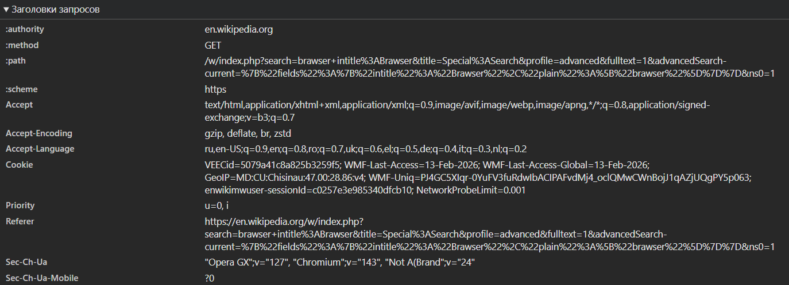
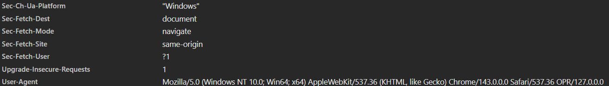

# Лабораторная работа N1. HTTP запросы

## Задание 1

- URL адресс: https://en.wikipedia.org/wiki/HTTP
- Метод запроса: GET. Данный метод используется для получения информации с сервиса. В данном случае (после перезагрузки) для получения данных страницы.
- Заголовки ответов:
  
  * content-type — тип данных возвращаемый сервером
  * date — время запроса
  * last-modified - дата последнего обновления ответа
  * server — название и версия сервера

- Заголовки запросов

  * authority — к какому домену будет идти зарпос
  * method — метод отправляемый на сервер
  * path — запрашиваемый ресурс
  * scheme — протокол получаения данных
  * referer — с какого сайта был переход на сайт
  * user-agent — какой браузер, ос
  * accept — какие типы данных готов принять
  * accept-language — отправляет допустимые языки интрефейса.

- Тело запроса: отссутсвует так как метод GET.
- Тело ответа: Представляет собоый html код.


- Ни одного ответа не было отпраленно.
- Данный адрес выдаёт ошибку 404.

## Задание  2

- https://en.wikipedia.org/w/index.php?search=brawser+intitle%3ABrawser&title=Special%3ASearch&profile=advanced&fulltext=1&advancedSearch-current=%7B%22fields%22%3A%7B%22intitle%22%3A%22Brawser%22%2C%22plain%22%3A%5B%22brawser%22%5D%7D%7D&ns0=1
- Метод запроса: GET. Поскольку запрос с сервера взврващает данные по запросу
- Query запросы: 

  - serch — поиск по заголовкам статей
  - title —
  - profile — указывает метод поиска, в данном случае расширенный поиск
  - fullText — поиск по страницам в википедии

- 
- 

## Задание  3

- URL запроса https://github.com/AndreiKlinchev
- Метод запроса GET
- Код статус 200 (всё ок)
- Заголовки ответов

  - cache-control — HTTP-заголовок ответа, который управляет кэшированием
  - content-type — указывает тип содержимого тела запроса или ответа
  - Content-Security-Policy — прописывает защиту от все воможных атак

- Заголовки запросов
  
  - authority - домен, на который отправляется запрос
  - method - метод
  - path - путь внутри домена
  - scheme - протокол запроса
  - accept-encoding допустимые форматы архивирования
  - accept-language — допустимый язык
  - user-agent — информация об устройстве клиента
  - referer — страница с которой клиент перешёл на текущую

## Задание  4

1. Составляю запос по адресу http://sandbox.usm.com указав в заголовке User-Agent моё имя и фамилию.

```
GET / HTTP/1.1  
Host : sandbox.usm.com
User-Agent : KlincheAndrei
```

2. Составьте POST-запрос к серверу по адресу http://sandbox.usm.com/cars, указав в теле запроса параметры из условия:

```
POST /cars HTTP/1.1
Host: sandbox.usm.com
User-Agent: KlincheAndrei
Content-Type: application/json
{
  "make": "Toyota",
  "model": "Corolla",
  "year": 2020
}
```

3. Составьте PUT-запрос к серверу по адресу http://sandbox.usm.com/cars/1, указав в заголовке User-Agent ваше имя и фамилию, в заголовке Content-Type значение application/json и в теле запроса следующие параметры:

```
POST /cars HTTP/1.1
Host: sandbox.usm.com
User-Agent: KlincheAndrei
Content-Type: application/json
{
  "make": "Toyota",
  "model": "Corolla",
  "year": 2020
}
```

4. Ответ от сервера

```
HTTP/1.1 400 Bad Request
```

## Задание  5

- 200 OK — рсурс создана успешно и сервер возвращает результат
- 201 Created — ресурс успешно создан
- 400 Bad Request — неверно введены данные
- 401 Unauthorized — не пройдена авторизация
- 403 Forbidden — доступ запрещён
- 404 Not Found — не существует
- 500 Internal Server Error — ошибка на сервере

## Контрольные вопросы

> Что такое User-Agent и для чего он используется?

Содержит информацию о браузере (клиенте) и операционной системе клиента.

> Какие еще методы HTTP-запросов существуют и для чего они используются?

patch — частично обновляет ресурс
post — создать новый ресурс
delete — удалить ресурс
put — обновить существующий ресурс

> В чем разница между PATCH и PUT запросами?

PUT запрос, полностью обновляет текущий ресурс. PUSH запрос, частично обновляет существующий запрос