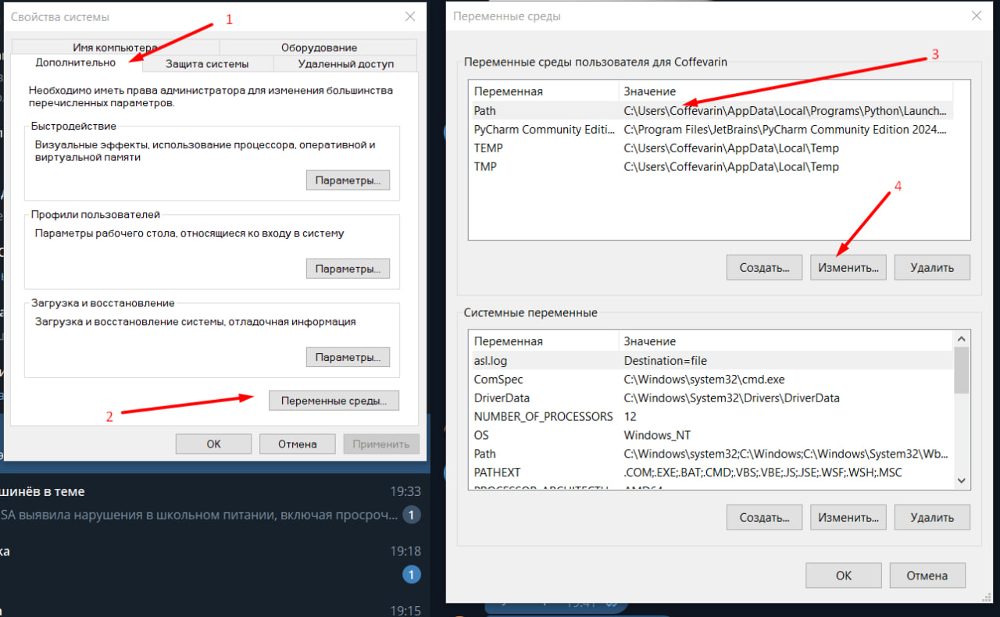
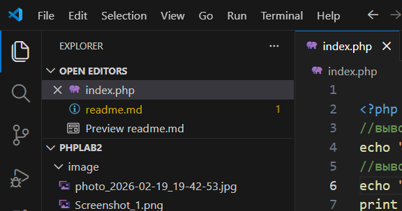
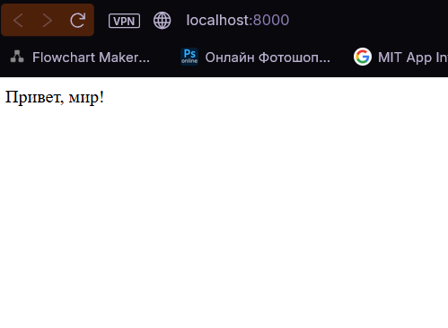
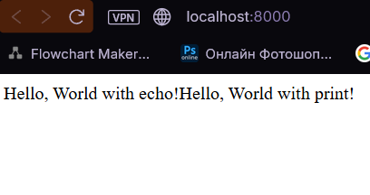
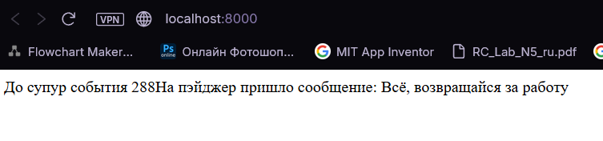

# Лабораторная работа №2

## Задание 1 - Установка PHP

1. С сайта [php](https://www.php.net/downloads.) загружаем ```.zip``` с последней версией php
2. Извлекаем содержимое архива в удобную папку, в моём случае ```C:\Program Files\php```
3. Настраиваем переменные среды
   1. Открываем параметры системы ```Win + R``` → ```sysdm.cpl```
   2. Переходим в переменные среды ```C:\Program Files\php``` в поле 
   3. Добавляем новую перемнную в path
   
   4. Сохраняем изменения
4. Проверяем установку, в ```cmd``` вписываем ```php -v```

## Задание 2 - первая PHP программа

1. Создаём удобную для нас дерикторию ```D:\USM\Second year\PHP\phpLab2>```
2. Создаю index.php и открываю VS code\
   

3. ```php
    <?php
        echo "Привет, мир!";
    ```

4. Запускаем локальный сервер и смотрим что получилось
   - ```PS D:\USM\Second year\PHP\phpLab2> php -S localhost:8000``` \
     ```[Fri Feb 20 00:42:05 2026] PHP 8.5.3 Development Server (http://localhost:8000) started```
   - 

## Задание 3 - Вывод данных в PHP

Ввожу строки:

```echo "Hello, World with echo!";```

```print "Hello, World with print!";```

Результат:



## Задание 4 - Работа с переменными и выводом

1. Создаю 2 переменные
   - ```$days = 288;```
   - ```$message = "Всё, возвращайся за работу";```
2. Ввожу значение переменных на экран разными способами
   - ```echo "До супур события ".$days;```
   - ```echo "На пэйджер пришло сообщение: {$message}";```



3. Использование тега ```<br>```

```php
<?php
    //вывод 1
    echo "Привет, мир!", "ДА ДА МИР, ПРИВЕТ!";
    //вывод 2
    echo "</br>Hello, World with echo!";
    print "</br>Hello, World with print!";

    //вывод 3
    $days = 288;
    $message = "Всё, возвращайся за работу";
 
    echo "</br>До супур события".$days;
    echo "</br>На пэйджер пришло сообщение: {$message}";
?>
```

## Ответы на вопросы

### Какие способы установки PHP существуют?

#### Существует 2 основных способа установки php

1. Установить php на комьпьютер, а затем прописать переменную среды, с дерикторией расположения языка, чтобы система могла запускать php из командной строки.
2. Усановить PHP вместе с готовым комплектом инструментов в виде одной программы, с возможностьб подключения и отключения модулей. По сути это локальный сервер. Один из самых популярных инструменов это XAMPP.

### Как проверить, что PHP установлен и работает?

В командной строке нужно просто написать ```php -v```. Если php установлен и работает исправно, в таком случае выведиться версия программы. Если нет, появиться ошибка, по типу: ```"php не является внутренней или внешней командой системы"```.

### Чем отличается оператор echo от print?

|      Различия       | echo  | print |
|---------------------|-------|-------|
| Возвращает значение |  нет  |   1   |
| Несколько строк     |   да  |  нет  |
| Скорость            | fast  |  low  |
