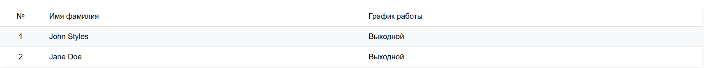

# Лабораторная работа №3

## Задание 1

> Используя функцию `date()`, создайте таблицу с расписанием, формируемым на основе текущего дня недели.
> 
> | № | Имя Фамилия | График работы |
> |---| ----| ----|
> |1 |	John Styles |	xx - xx |
> |2 |	Jane Doe |	yy - yy|
### Функция для расчёта графика

```php
<?php

function empGraphic($arr, $workHours){
    $day = date("w");

    if (in_array($day, $arr)){
        echo $workHours;
    }
    else{
        echo "Выходной";
    }
}

?>
```

### Код HTML

```html
 <table>
        <tr>
            <td>№</td>
            <td>Имя фамилия</td>
            <td>График работы</td> 
        </tr>
        <tr>
            <td>1</td>
            <td>John Styles</td>
            <td><?php empGraphic([1,2,3], "8:00-12:00.") ?></td>
        </tr>
        <tr>
            <td>2</td>
            <td>Jane Doe</td>
            <td>
                 <?php empGraphic([2,4,6], "12:00-16:00.") ?></td>
        </tr>
    </table>
```



## Задание 2

> Создайте файл с кодом:

```php
<?php

$a = 0;
$b = 0;

for ($i = 0; $i <= 5; $i++) {
   $a += 10;
   $b += 5;
}

echo "End of the loop: a = $a, b = $b";
```

### Изменённыйе циклы

> Добавьте вывод промежуточных значений $a и $b на каждом шаге цикла.
> Перепишите этот цикл, используя оператор while и do-while.

```php
$a = 0;
$b = 0;

for ($i = 0; $i <= 5; $i++) {
    $a += 10;
    $b += 5;
    echo "Значение а: {$a}\tЗначение b: {$b}";
    echo "<br />";
}
echo "End of the loop: a = $a, b = $b";
echo "<br /><br />";


$a = 0;
$b = 0;
$wi = 0;
while ($wi <= 5){
    $a += 10;
    $b += 5;
    echo "Значение а: {$a}\tЗначение b: {$b}";
    echo "<br />";
    $wi++;
}
echo "End of the loop: a = $a, b = $b";

echo "<br /><br />";
$dwi = 0;

$a = 0;
$b = 0;
do{
    $a += 10;
    $b += 5;
    echo "Значение а: {$a}\tЗначение b: {$b}";
    echo "<br />";
    $dwi++;

}while($dwi <= 5);

echo "End of the loop: a = $a, b = $b";

```

### Ответы на вопросы

> В чем разница между циклами for, while и do-while? В каких случаях лучше использовать каждый из них?

- `for` — Это итеративный цикл, который, используется когда заранее известно количество итераций или нужно работать с массивами по индексу.
- `while` — условный цикл, работает если соблюдается условие. При этм сначала проверка условия, и если соответствует требованиям то выполняется тело цикла, используется когда заранее не известно количество итераций.
- `do-while` — также является условным циклом, однако проверка осуществляется только после выполнения цикла.

> Как работает тернарный оператор ? : в PHP?

Это однострочная и укороченное представление `if` по факту. Имеет такую форму: `$a > $b ? true : false`

> Что произойдет, если в do-while поставить условие, которое изначально ложно?

Если поставить заведомо ложное значение в do-while цикл всё равно выполнит одну итерацию цикла, посколько проверка истинности условия проиcходит всегда в конце.