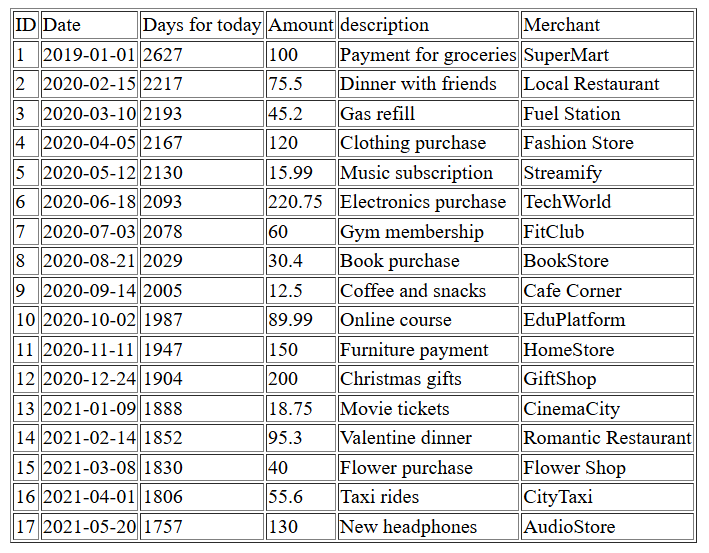
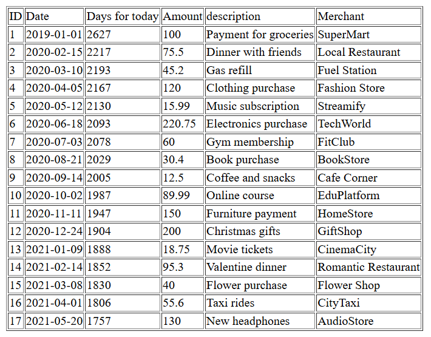
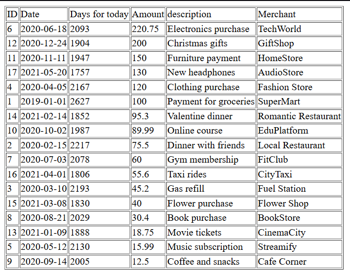

# Лабораторная работа №4: Массивы и Функции в PHP

## Цель работы

Освоить работу с массивами в PHP, применять операции: создание, добавление, удаление, сортировка и поиск.
Закрепить навыки работы с функциями, включая передачу аргументов, возвращаемые значения и анонимные функции.

## Ход работы

### Задание 1. Работа с массивами

#### 1.1 Подготовка среды

* Установлен PHP 8+.
* Создан файл `index.php` с включённой строгой типизацией:

```php
<?php
declare(strict_types=1);
```

#### 1.2 Создание массива транзакций

* Создан массив `$transactions`, содержащий 17 транзакций.
* Каждая транзакция представлена ассоциативным массивом с полями: `id`, `date`, `amount`, `description`, `merchant`.

**Пример транзакции:**

```php
[
    "id" => 1,
    "date" => "2019-01-01",
    "amount" => 100.00,
    "description" => "Payment for groceries",
    "merchant" => "SuperMart",
]
```

#### 1.3 Вывод списка транзакций

* Для вывода использован цикл `foreach`.
* Данные отображаются в HTML-таблице с заголовками: `ID`, `Date`, `Days for today`, `Amount`, `Description`, `Merchant`.
* Добавлен столбец **количество дней с момента транзакции** с использованием функции `daysSinceTransaction()`.

**Скриншот таблицы транзакций:**


#### 1.4 Реализация функций

1. **`calculateTotalAmount(array $transactions): float`**

   * Вычисляет общую сумму всех транзакций.
   * Вывод суммы в конце таблицы.

    ```php
    /**
    * Calculates the total amount of transactions.
     *
    * @param array $transactions Array of transactions, each containing the key "amount".
    * @return float|null Returns the sum of amounts, or null if the array is empty.
    */
    function calculateTotalAmount(array $transactions): ?float {
        if (empty($transactions)) {
            return null;
        }

        $sum = 0;
        foreach ($transactions as $elem) {
            $sum += $elem["amount"];
        }

        return $sum;
    }
    ```

1. **`findTransactionByDescription(string $descriptionPart): ?array`**

   * Поиск транзакции по части описания.
   
   ```php
    /**
    * Finds the first transaction containing the specified part of the description.
    *
    * @param string $descriptionPart Part of the description to search for.
    * @return array|null Returns the transaction as an array, or null if not found.
    */
    function findTransactionByDescription(string $descriptionPart): ?array {
        foreach ($transactions as $elem) {
            if (str_contains($elem["description"], $descriptionPart)) {
                return $elem;
            }
        }
        return null;
    }
   ```

2. **`findTransactionById(array $transactions, int $id): array`**

   * Поиск транзакции по ID с использованием `array_filter` (для высшей оценки).

    ```php
    /**
    * Finds transactions by their ID.
    *
    * @param int $id Transaction ID to search for.
    * @return array Array of transactions matching the ID (may be empty).
    */
    function findTransactionById(int $id): array {
        return array_filter($transactions, function ($el) use ($id) {
            return $el["id"] == $id;
        });
    }
    ```

3. **`daysSinceTransaction(string $date): int`**

   * Возвращает количество дней между датой транзакции и текущей датой.

    ```php
    /**
    * Calculates the number of days since the specified date until today.
    *
    * @param string $date Date as a string (e.g., "2026-03-12").
    * @return int Number of days.
    */
    function daysSinceTransaction(string $date): int {
        return (int) (new DateTime($date))->diff(new DateTime())->days;
    }
    ```

4. **`addTransaction(int $id, string $date, float $amount, string $description, string $merchant): void`**

   * Добавление новой транзакции в глобальный массив `$transactions`.

    ```php
    /**
    * Adds a new transaction to the global $transactions array.
    *
    * @param int $id Transaction ID.
    * @param string $date Transaction date as a string.
    * @param float $amount Transaction amount.
    * @param string $description Transaction description.
    * @param string $merchant Merchant name.
    * @return void
    */
    function addTransaction(int $id, string $date, float $amount, string $description, string $merchant): void {
        global $transactions;
        $transactions[] = [
            "id" => $id,
            "date" => new DateTime($date),
            "amount" => $amount,
            "description" => $description,
            "merchant" => $merchant,
        ];
    }
    ```

#### 1.5 Сортировка транзакций

* Сортировка по дате с использованием `usort()`:

```php
usort($transactions, "dateSort");
```



* Сортировка по сумме (по убыванию):

```php
usort($transactions, "amountSort");
```


### Задание 2. Работа с файловой системой

1. Создана директория `image/` с 20–30 изображениями.
2. Создан скрипт `index.php` для вывода изображений в виде галереи.
3. Используется `scandir()` для получения списка файлов.


## Контрольные вопросы

1. Что такое массивы в PHP?

Массивы в PHP - это структура данных для хранения набора значений под ключами (индексами или строками).

1. Каким образом можно создать массив в PHP?

Используя функцию `array()` или короткий синтаксис `$arr = []`:

1. Для чего используется цикл `foreach`?

Для последовательного перебора всех элементов массива или объекта. Удобен для работы с ассоциативными массивами.

## Выводы

* Были изучены массивы и операции с ними: добавление, удаление, сортировка, поиск.
* Практически применены функции PHP с передачей аргументов и возвратом значений.
* Освоено использование глобальных переменных внутри функций.
* Практика с файловой системой: чтение директории, фильтрация файлов и вывод изображений на страницу.
* Получены навыки работы с HTML и CSS для представления данных в виде таблиц и галерей.
